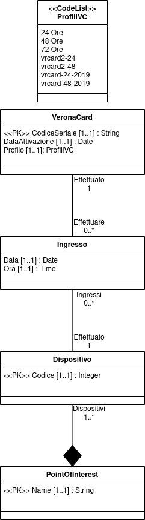
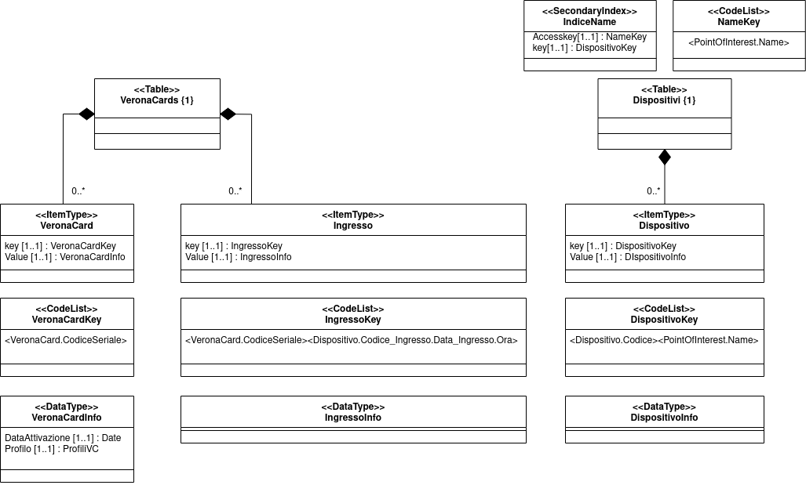

# Progetto fondamenti di sistemi informativi
Progetto per il corso di fondamenti di sistemi informativi ad UniVr

## Obbiettivo
Il progetto prevede di scegliere un dataset ed un sistema(tra quelli visti durante il corso) e produrre:
* Uno schema concettuale del dataset (UML)
* Uno schema fisico del dataset per il sistema scelto (UML)  

Successivamente caricare il dataset sul sistema ed eseguire query accordate col professore, per poi valutarne le performance.

Ho scelto il sistema Amazon DynamoDb, ed il dataset VeronaCard.

# Dataset
Il dataset VeronaCard consiste in 7 file csv contenti collezioni di strisciate delle VeronaCards su dei dispositivi, dall'anno 2014 al 2020.
Tutti i file rispettano la stessa struttura, in cui ogni record contiene:
- Data ingresso
- Ora ingresso
- Point of interest
- Dispositivo su cui è stata effettuata la strisciata della VeronaCard
- Codice seriale della VeronaCard
- Data di attivazione della VeronaCard
- Profilo della VeronaCard (24-48-72 Ore)

## Nota  
Oltre agli attributi soprastanti, i file presentano anche:
* una colonna che denota il tipo di strisciata
* una colonna che denota il tipo di sconto (i cui valori sono 0,1,2)  

Ho deciso di non considerare questi due attributi in quanto:
* La prima colonna citata presenta sempre lo stesso valore "in" in ogni tupla di ogni file, ed essendo una collezione di ingressi, mi è sembrato ridondante considerarla
* Nella consegna non erano specificate, perciò ho assunto avessero poca rilevanza  

In caso, queste due informazioni, possono comunque essere integrate facilmente. 
## Schema concettuale del dataset
<p align="center">
  
</p>

### Entità
* *VeronaCard* :  
Rappresenta una veronacard, identificata dal codice seriale e corredata dalle altre proprietà come la data di attivazione ed il profilo.  
I valori del profilo sono stati rappresentati da una CodeList perché, nonostante rappresentino sempre lo stesso concetto, la loro codifica è cambiata nel corso degli anni. Ad esempio il profilo "24 Ore" è cambiato a "vrcard2-24" e successivamente a "vrcard-24-2019". Inoltre il profilo da 72 Ore è stato tolto.
* *Dispositivo* :  
Rappresenta un dispositivo su cui viene passata la veronacard, è identificato da un codice univoco
* *PointOfInterest* :  
Rappresenta un luogo visitabile, è identificato dal nome

### Relazioni
* *Ingresso* :  
Rappresenta la relazione con attributi (Data ed Ora) tra VeronaCard e Dispositivo. Ogni veronacard può effettuare **N** ingressi, ma ogni ingresso è relativo ad una sola veronacard. Ogni dispositivo può registrare **N** ingressi, ma ogni ingresso viene effettuato su un solo dispositivo
* *PointOfInterest-Dispositivo* :  
Questa relazione indica chiaramente che un dispositivo è legato ad uno ed uno sol PointOfInterest, mentre ogni PointOfInterest può avere **N** dispositivi che ne permettono l'accesso

### Note dello schema concettuale
Di primo acchito sembra che lo schema concettuale catturi la struttura dei dati presenti nei file, tuttavia, scavando un po' si trovano dei record che ne mettono in discussione la correttezza:
| Data | Ora |PointOfInterest | Dispositivo | CodiceSeriale | DataAttivazione | in | # | Profilo|
|------|-----|----------------|-------------|---------------|-----------------|----|---|--------|
|08-04-15|13:26:05|Casa Giulietta|28|04205D02882881|30-03-15|in|1|vrcard2-24|
|30-03-15|11:30:26|Casa Giulietta|28|04205D02882881|30-03-15|in|1|vrcard2-24|
|30-03-15|11:04:55|Arena|28|04205D02882881|30-03-15|in|1|vrcard2-24|

Perciò ho cercato quali altri dispositivi si ripetessero in diversi PointOfInterest. Poi ho cercato, di anno in anno, a quali PointOfInterest facessero riferimento:

|Dispositivo|2014|2015|2016|2017|2018|2019|2020|
|-|----|----|----|----|----|----|----|
|23|Centro Fotografia|Museo Conte,Centro Fotografia|Museo Conte|Museo Conte|x|Duomo|Duomo|
|28|x|Casa Giulietta,Arena|Casa Giulietta|Casa Giulietta|Casa Giulietta|Casa Giulietta|Casa Giulietta|
|29|Sant'Anastasia|Sant'Anastasia|Sant'Anastasia|Sant'Anastasia|Sant'Anastasia|Sant'Anastasia,Museo Miniscalchi|Museo Miniscalchi|

Nella mia opinione, la causa della presenza di questi record è dovuta a:  
* Anomalie nei dispositivi (Prima tabella soprastante)
* Riutilizzo dei dispositivi durante gli anni (come si può vedere per il dispositivo 23)
* Eventi temporanei realizzati all'interno di PointOfInterest

Dato che la maggiorparte del dataset rispetta le entità e le relazioni nello schema concettuale, ho deciso di modificarlo, in modo che tutti i record lo rispettino:  
* Ho eliminato i record (7) nel file ```dati_2015.csv``` in cui il dispositivo 28 ha registrato ingressi all'Arena
* I record contententi ```[..],Centro Fotografia,23,[..]``` sono diventati ```[..],Centro Fotografia,102,[..]```
* I record contententi ```[..],Duomo,23,[..]``` sono diventati ```[..],Duomo,103,[..]```
* I record contententi ```[..],Museo Miniscalchi,29,[..]``` sono diventati ```[..],Museo Miniscalchi,32,[..]``` perché 32 è stato il dispositivo "storico" per quel pointofinterest

# Schema fisico per DynamoDB
<p align="center">
  
</p>

## Tabelle
Ho deciso di racchiudere i dati in due tabelle, che rappresentano i due principali metodi di accesso ai dati

### VeronaCards
Questa tabella contiene due tipi di item:
* Le veronacards : Identificate dal codice seriale univoco, contengono anche la data di attivazione ed il profilo
* Gli ingressi : Identificati dal codice seriale univoco, ed una stringa che contiene il codice del dispositivo su cui è stata passata la veronacard, la data e l'ora 

### Dispositivi
Questa tabella contiene solo la lista di dispositivi, identificati dal codice e dal nome del pointOfInterest

### Indice Secondario
Ho deciso di creare un indice secondario su PointOfInterest.Name in modo da poter accedere a tutti i dispositivi localizzati in un certo PointOfInterest

# Implementazione
## Installazione di DynamoDBLocal
Ho scelto di installare DynamoDBLocal in quanto è uno strumento autocontenuto che permette agli sviluppatori di esplorare le varie features offerte da DynamoDB, e permette in modo molto semplice e veloce di avere un database funzionante. Bastano pochi comandi:  
```console
user@desktop:~$ mkdir dynamoDBLocal
user@desktop:~$ cd dynamoDBLocal
user@desktop:~$ wget http://dynamodb-local.s3-website-us-west-2.amazonaws.com/dynamodb_local_latest.tar.gz
user@desktop:~$ tar xzf dynamodb_local_latest.tar.gz
user@desktop:~$ java -Djava.library.path=./DynamoDBLocal_lib/ -jar DynamoDBLocal.jar
```
A questo punto è attivo il servizio sulla porta ```8000``` che ci permette di interagire con il database.

## Perfomance DynamoDBLocal
Essendo uno strumento di sviluppo con l'obbiettivo di esplorare l'api di DynamoDB, purtoppo non è ottimizzato per immagazzinare grandi quantità di dati.
Difatti ho provato a caricare tutto il file ```dati_2014.csv``` lasciando il programma girare per qualche ora, ma non ha nemmeno terminato. Questo perché, stando a fonti online, DynamoDBLocal si appoggia a SQLite in cui le operazioni di scrittura sono abbastanza lente.
Per questo, nella fase iniziale, ho implementato il caricarimento dei dati mettendo un limite delle tuple considerate per file. Perciò:
* La tabella *VeronaCards* avrà sicuramente #items > Limit (**Limit** ingressi + **Limit** >= #veronacards)
* La tabella *Dispositivi* avrà sicuramente #items < Limit perché ce ne sono solo qualche decina

## Linguaggio di programmazione e client
Come linguaggio di programmazione ho scelto ```python``` e come client per interagire con il database ho scelto ```boto3```

## Schema delle tabelle
In DynamoDB è obbligatorio fornire solo lo schema delle chiavi (partition key e sort key) quando si crea una tabella. Di seguito gli schemi (in formato json) per le due tabelle previste dal modello fisico
### VeronaCards
KeySchema  
```javascript
{
    'AttributeName': 'CodiceSeriale',
    'KeyType'      : 'HASH'
}
{
    'AttributeName': 'ChiaveOrdinamento',
    'KeyType'      : 'RANGE'
}
```
AttributeDefinitions  
```javascript
{
    'AttributeName': 'CodiceSeriale',
    'AttributeType': 'S'
}
{
    'AttributeName': 'ChiaveOrdinamento',
    'AttributeType': 'S'
}
```
In questo caso la partition key è ```CodiceSeriale``` mentre la sort key è ```ChiaveOrdinamento```.
Per gli item che rappresentano le veronacards la sort key assumerà il valore ```Info```, mentre per gli item che rappresentano gli ingressi la sort key sarà una stringa che contiene il dispositivo, la data e l'ora.

## Dispositivi
KeySchema
```javascript
{
    'AttributeName': 'Codice',
    'KeyType'      : 'HASH'
}
{
    'AttributeName': 'Name',
    'KeyType'      : 'RANGE'
}
```
AttributeDefinitions
```javascript
{
    'AttributeName': 'Codice',
    'AttributeType': 'S'
}
{
    'AttributeName': 'Name',
    'AttributeType': 'S'
}
```
In questo caso la partition key è ```Codice``` mentre la sort key è ```Name```.
Ogni item in questa tabella consta solo di partition e sort key.

Indice secondario globale  
```javascript
{
  'IndexName' : 'IndiceName',
  'KeySchema' : [
      {
          'AttributeName': 'Name',
          'KeyType': 'HASH'
      }]
}               
```
## Query semplici
### Ottenere una certa veronacard
```python
dynamoDbClient.Table('VeronaCards').get_item(
  TableName='VeronaCards',
  Key={'CodiceSeriale':'04FA80523F3880','ChiaveOrdinamento':'Info'}
)
```
risultato
```javascript
{'ChiaveOrdinamento': 'Info', 'CodiceSeriale': '04FA80523F3880', 'Profilo': '72 Ore', 'DataAttivazione': '30-12-14'}
```
### Ingressi di una certa veronacard con un certo dispositivo
```python
dynamoDbClient.Table('VeronaCards').query(
  TableName='VeronaCards',
  KeyConditionExpression=Key('CodiceSeriale').eq('04FA80523F3880')&Key('ChiaveOrdinamento').begins_with('40')
)
```
risultato
```javascript
{'CodiceSeriale': '04FA80523F3880', 'ChiaveOrdinamento': '40_30-12-14_16:34:00'}
```
### Ingressi in un certo dispositivo
```python
dynamoDbClient.Table('VeronaCards').scan(
  FilterExpression=Attr('ChiaveOrdinamento').begins_with('40'),
  Limit=800
)
```
risultato
```javascript
{'CodiceSeriale': '0459C2523F3880', 'ChiaveOrdinamento': '40_30-12-14_17:01:53'}
{'CodiceSeriale': '046E45E2185080', 'ChiaveOrdinamento': '40_30-12-18_18:06:53'}
{'CodiceSeriale': '04DA75BA7B3F80', 'ChiaveOrdinamento': '40_30-12-16_17:52:16'}
{'CodiceSeriale': '04F602F2185084', 'ChiaveOrdinamento': '40_31-10-20_14:54:19'}
{'CodiceSeriale': '04E3A64A216280', 'ChiaveOrdinamento': '40_05-03-20_10:52:05'}
{'CodiceSeriale': '04AB21BA7B3F80', 'ChiaveOrdinamento': '40_30-12-16_17:05:28'}
{'CodiceSeriale': '04AC57523F3880', 'ChiaveOrdinamento': '40_30-12-14_15:32:14'}
{'CodiceSeriale': '0476EAE2185080', 'ChiaveOrdinamento': '40_30-12-18_16:26:04'}
{'CodiceSeriale': '040C45F2185085', 'ChiaveOrdinamento': '40_30-12-19_16:15:15'}
```
### Ingressi in una certa data
```python
dynamoDbClient.Table('VeronaCards').scan(
  FilterExpression=Attr('ChiaveOrdinamento').contains('30-12-16'),
  Limit=10
)
```
risultato
```javascript
{'CodiceSeriale': '04AF043A9C4C84', 'ChiaveOrdinamento': '25_30-12-16_15:44:13'}
{'CodiceSeriale': '04AF043A9C4C84', 'ChiaveOrdinamento': '28_30-12-16_17:15:49'}
{'CodiceSeriale': '048565C27B3F80', 'ChiaveOrdinamento': '28_30-12-16_15:42:35'}
{'CodiceSeriale': '048565C27B3F80', 'ChiaveOrdinamento': '41_30-12-16_16:32:20'}
```
### Ottenere un certo dispositivo
```python
dynamoDbClient.Table('Dispositivi').get_item(
  TableName='Dispositivi',
  Key={'Codice':'25','Name':'Arena'}
)
```
risultato
```javascript
{'Codice': '25', 'Name': 'Arena'}
```
### Ottenere tutti i dispositivi di un certo pointOfInterest sfruttando l'indice globale secondario
```python
dynamoDbClient.Table('Dispositivi').query(
  TableName='Dispositivi',
  IndexName='IndiceName',
  KeyConditionExpression=Key('Name').eq('Duomo'),
  Limit=10
)
```
risultato
```javascript
{'Codice': '31', 'Name': 'Duomo'}
{'Codice': '103', 'Name': 'Duomo'}
```
## Caricamento dati su AWS DynamoDB
Una volta testato il caricamento dei dati su DynamoDBLocal, ho deciso di provare il vero e proprio sistema offerto da Amazon. Questo ha richiesto la creazione di un account AWS che permette di usufruire gratuitamente degli amazon web services entro certi limiti utilizzo. Per quanto riguarda DynamoDB, il free tier comprende 25 GB di storage, e tabelle con una Provisioned Write Capacity pari a 25 unità, stessa cosa per la Read Capacity.
Ho modificato il file ```loadDataset.py``` inserendo le credenziali del mio account alla creazione del client ed ho avviato il programma. All'inizio le WCU e le RCU delle tabelle erano impostate a 10, poi le ho modificate a 24 per VeronaCards ed a 5 per Dispositivi. Il programma è stato fermato dopo aver eseguito per un intero weekend. Sono stati caricati:
* 1.741.376 item nella tabella VeronaCards (il totale dei record nel dataset supera i 5M)
* 29 item nella tabella Dispositivi  

Che ho ritenuto sufficienti per poter testare le query.

## Query
Per avere una conferma della correttezza delle query, ho caricato il file ```dati_2014.csv``` su postgres e prima di scriverle per DynamoDB, le ho scritte in SQL annotandomi il risultato.

### Nota

#### DynamoDBLocal
È possibile avviare DynamoDBLocal con l'opzione ```-inMemory```, che evita di scrivere su disco i dati e li mantiene in RAM. Questo permette di ovviare al problema delle perfomance di cui ho parlato sopra, permettendomi di testare velocemente le query.
#### AWS DynamoDB
Alla creazione dell'account, la zona di default è ```us-east-1```, che purtroppo non ho cambiato. Visto che i server sono lontani, la latenza influisce molto sulle performance delle query
### Query 1
Assegnato un mese di un anno, trovare per ogni giorno del mese il numero totale di accessi ai due POI dati in input
#### SQL
```SQL
SELECT data,COUNT(*)
FROM ingressi
WHERE data >= '1-12-14' AND data <= '31-12-14' AND pointofinterest = 'Tomba Giulietta'
GROUP BY data;

SELECT data,COUNT(*)
FROM ingressi
WHERE data >= '1-12-14' AND data <= '31-12-14' AND pointofinterest = 'Casa Giulietta'
GROUP BY data;
```
#### DynamoDB
```python
def find_enterings_in_POI(veronaCardsTable,dispositiviTable,month,year,POI):

    # TROVO IL CODICE DEL DISPOSITIVO DEL POI
    response = dispositiviTable.query(
        IndexName = 'IndiceName',
        KeyConditionExpression = Key('Name').eq(POI)
    )

    dispositivo = response['Items'][0]['Codice']

    # TROVO GLI INGRESSI EFFETTUATI SU QUEL DISPOSITIVO, NEL MESE E ANNO INDICATI
    response = veronaCardsTable.scan(
        FilterExpression = Attr('ChiaveOrdinamento').begins_with(dispositivo)&Attr('ChiaveOrdinamento').contains('-'+month+'-'+year+'_')
    )
    ingressi = response['Items']

    while 'LastEvaluatedKey' in response:
        response = veronaCardsTable.scan(
            ExclusiveStartKey=response['LastEvaluatedKey'],
            FilterExpression = Attr('ChiaveOrdinamento').begins_with(dispositivo)&Attr('ChiaveOrdinamento').contains('-'+month+'-'+year+'_')
        )
        ingressi.extend(response['Items'])

    # COSTRUISCO UNA MAPPA AVENTE COME CHIAVE LA DATA E COME VALORE IL CONTEGGIO DEGLI INGRESSI
    output = {}

    for item in ingressi:
        date = re.search(r'(\d+-\d+-\d+)',item['ChiaveOrdinamento']).group()

        if date not in output.keys():
            output[date] = 1
        else:
            output[date] = output[date] + 1 

    output = dict(sorted(output.items()))

    return output
```
Questa funzione viene chiamata due volte per ottenere l'output finale
```python
out1 = find_enterings_in_POI(veronaCardsTable,dispositiviTable,'12','14','Tomba Giulietta')
out2 = find_enterings_in_POI(veronaCardsTable,dispositiviTable,'12','14','Casa Giulietta')
```
#### Perfomance
* DynamoDBLocal : 50s
* AWS DynamoDB  : 734s

### Query 2
Trovare il POI che ha avuto il numero minimo e il POI che ha avuto il numero massimo di accessi in un giorno assegnato

#### SQL
```SQL
SELECT pointofinterest, COUNT(*) AS ingressi
FROM ingressi
WHERE data = '30-12-14'
GROUP BY pointofinterest
HAVING COUNT(*) = (
	SELECT MIN(conteggio)
	FROM (
		SELECT i1.pointofinterest AS poi,COUNT(*) AS conteggio
		FROM ingressi i1
		WHERE data = '30-12-14'
		GROUP BY pointofinterest
	) AS conteggi
);

SELECT pointofinterest, COUNT(*) AS ingressi
FROM ingressi
WHERE data = '30-12-14'
GROUP BY pointofinterest
HAVING COUNT(*) = (
	SELECT MAX(conteggio)
	FROM (
		SELECT i1.pointofinterest AS poi,COUNT(*) AS conteggio
		FROM ingressi i1
		WHERE data = '30-12-14'
		GROUP BY pointofinterest
	) AS conteggi
);
```
#### DynamoDB
```python
# TROVO TUTTI GLI INGRESSI DEL GIORNO D'INTERESSE
response = veronaCardsTable.scan(
    FilterExpression = Attr('ChiaveOrdinamento').contains('_30-12-14_')
)
ingressi = response['Items']

while 'LastEvaluatedKey' in response:
    response = veronaCardsTable.scan(
        ExclusiveStartKey=response['LastEvaluatedKey'],
        FilterExpression = Attr('ChiaveOrdinamento').contains('_30-12-14_')
    )
    ingressi.extend(response['Items'])

# RICOSTRUISCO UNA MAPPA AVENTE I POI COME CHIAVE E LA LISTA DI DISPOSITIVI COME VALORE
response = dispositiviTable.scan()

pointOfinterest = {}
for item in response['Items']:
    if item['Name'] not in pointOfinterest.keys():
        pointOfinterest[item['Name']] = [item['Codice']]
    else:
        pointOfinterest[item['Name']].append(item['Codice'])

# INIZIALIZZO UNA MAPPA CHE CONTA I GLI INGRESSI PER OGNI POI
ingressiPerPOI = {}
for poi in pointOfinterest.keys():
    ingressiPerPOI[poi] = 0

# PER OGNI INGRESSO TROVATO, CONTROLLO A QUALE POI FA RIFERIMENTO E AUMENTO IL CONTATORE DEGLI INGRESSI PER QUEL POI
for item in ingressi:
    dispositivo = re.search(r'(\d+_)',item['ChiaveOrdinamento']).group()[:-1]
    for poi in pointOfinterest.keys():
        if dispositivo in pointOfinterest[poi]:
	    ingressiPerPOI[poi] = ingressiPerPOI[poi] + 1 

# NON TUTTI I POI PRESENTI NEL SISTEMA SONO STATI ACCEDUTI NEL GIORNO D'INTERESSE, PERCIÒ LI ELIMINIAMO
keysToDelete = []
for poi in ingressiPerPOI.keys():
    if ingressiPerPOI[poi] == 0:
        keysToDelete.append(poi)

for key in keysToDelete:
    del ingressiPerPOI[key]

# TROVO IL MASSIMO ED IL MINIMO
min = sys.maxsize
place = ''

for poi in ingressiPerPOI.keys():
    if ingressiPerPOI[poi] < min:
        min = ingressiPerPOI[poi]
        place = poi

print('POI che ha registrato il minimo numero di ingressi nel giorno 30-12-14:')
print((place,min))

max = 0
place = ''
for poi in ingressiPerPOI.keys():
    if ingressiPerPOI[poi] > max:
        max = ingressiPerPOI[poi]
        place = poi

print('POI che ha registrato il massimo numero di ingressi nel giorno 30-12-14:')
print((place,max))
```
#### Perfomance
* DynamoDBLocal : 25s
* AWS DynamoDB  : 400s

### Query 3
Dato un profilo, TROVARE i codici delle veronacard (id) con quel profilo che hanno fatto almeno tre strisciate in uno stesso giorno, riportando il numero totale delle strisciate eseguite da quelle carte e il giorno il cui sono state fatte le tre strisciate

#### DynamoDB
```python
# TROVO TUTTE LE VERONACARDS CHE HANNO IL PROFILO RICHIESTO
response = veronaCardsTable.scan(
    FilterExpression=Attr('Profilo').eq('24 Ore'),
    ProjectionExpression='CodiceSeriale'
)

veronaCards = response['Items']

while 'LastEvaluatedKey' in response:
    response = veronaCardsTable.scan(
        ExclusiveStartKey=response['LastEvaluatedKey'],
        FilterExpression=Attr('Profilo').eq('24 Ore'),
        ProjectionExpression='CodiceSeriale'
    )
    veronaCards.extend(response['Items'])

output = {}

for item in veronaCards:
    veronaCard = item['CodiceSeriale']

    # TROVO GLI INGRESSI PER LA VERONACARD CORRENTE, FILTRANDO L'ITEM CHE CONTIENE LE INFO DELLA VERONACARD STESSA
    response = veronaCardsTable.query(
        KeyConditionExpression=Key('CodiceSeriale').eq(veronaCard),
        FilterExpression=Attr('Profilo').ne('24 Ore')
    )

    ingressi = response['Items']

    # CONSIDERO LE VERONACARDS CHE ABBIANO MINIMO 3 INGRESSI REGISTRATI
    if len(ingressi) < 3 :
        continue 

    # CONTO GLI INGRESSI PER OGNI DATA DISTINTA, **PER SEMPLICITÀ IMPLEMENTATIVA** PRENDO IN CONSIDERAZIONE 
    # SOLO LA PRIMA DATA CHE ABBIA MINIMO 3 INGRESSI      
    dateIngressi = [re.search(r'(\d+-\d+-\d+)',item['ChiaveOrdinamento']).group() for item in ingressi]

    ingressiPerGiorno = Counter(dateIngressi)

    for data in ingressiPerGiorno.keys():
        if ingressiPerGiorno[data] >= 3 :
	    output[veronaCard] = (data,ingressiPerGiorno[data])
	    break

for codiceSeriale in output.keys():
    print(f'{codiceSeriale} : {output[codiceSeriale]}')
```
#### Perfomance
* DynamoDBLocal : 88s
* AWS DynamoDB  : ?
